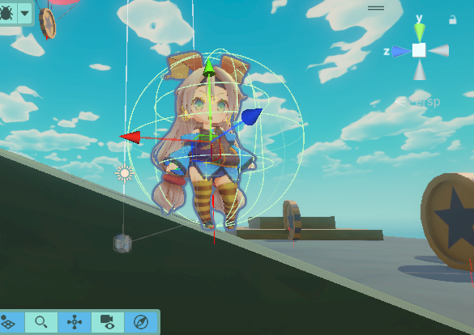
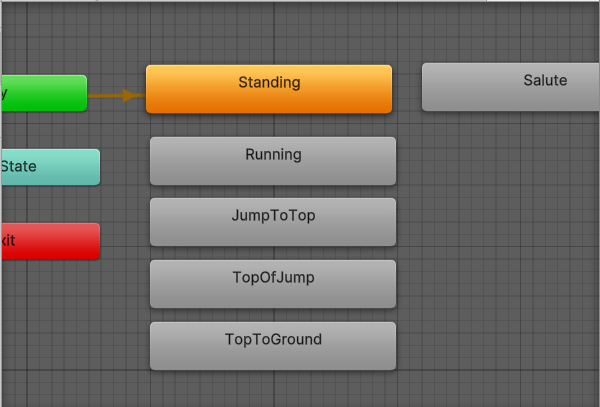
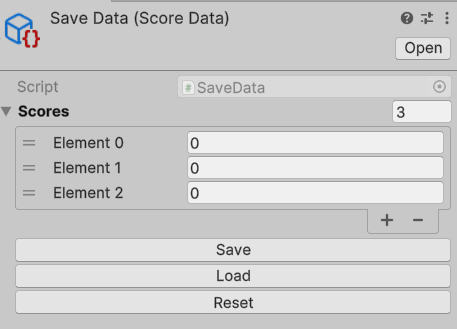
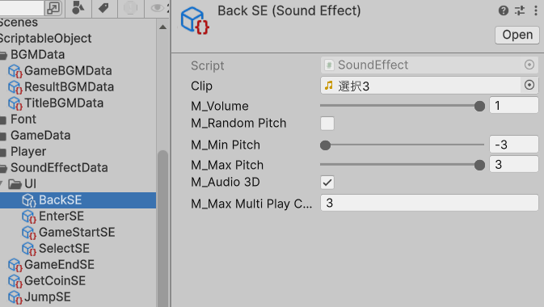

個人制作  

**制作期間**：2024/6/16 ~ 2022/12/25（10日間）  
**開発環境**：Unity6Preview(6000.0.5f1)、C#、DSPAcion(SE制作ツール)、GitHub、Sourcetree  
**ライブラリ**：R3,UniTask,DOTween

**操作方法**：   
**キーボード＆マウス**  
    **WASD**：カメラを基準とした前後左右の移動  
    **Space**：ジャンプ  
    **マウス移動**：カメラ回転  

**XBoxコントローラー**  
    **左スティック**：カメラを基準とした前後左右の移動  
    **Aボタン**：ジャンプ  
    **右スティック**：カメラ回転  

**ゲーム概要**  
Unityちゃんを操作して制限時間内にたくさんコインを集める3Dアクションゲームです。  
ラストスパート(8秒以下)になるとコインの出現数が多くなります。  
スコアは通常のコインで+1、より黄色いレアコインで+3されます。  

**こだわった点**  
プレイヤーの移動処理を作るにあたって以下の２点を最初に決めて作り始めました。
- タグ比較以外の汎用的な接地判定を用いること
- 斜めの床でずり落ちたり、移動速度が変わらないようにすること

## プレイヤーの接地判定


- タグ比較以外の汎用的な接地判定を用いること
タグ比較では地面オブジェクトに毎回タグ設定する手間がかかってしまうので、以下のようにレイによるオブジェクトの取得と、法線の比較で接地判定を行うようにしました。

`Player.cs：102行目`
```C#
internal bool CheckGround(out RaycastHit[] results)
{
	Vector3 startPos = transform.position;
	startPos.y -= m_rayOffsetY;
	Debug.DrawRay(startPos, new Vector3(0, -m_rayLength, 0), Color.red, 1.0f);
	results = Physics.RaycastAll(startPos, Vector3.down, m_rayLength);

	// レイが当たっていない場合終了
	if (results.Length == 0) return false;

	// 法線の内積で相対的な角度の取得
	float normalDot = Vector3.Dot(m_hitObjectList[0].normal, Vector3.up);

	// 急すぎる床は無視する
	return normalDot > m_slopeThreshold;
}
```

- 斜めの床でずり落ちたり、移動速度が変わらないようにすること
Rigidbodyをそのまま使うと斜めの床に弱いので、接地しているオブジェクトの法線を見ることで、ずり落ちたりしないようにしました。

`Player.cs：116行目`
```C#
// 斜めの床も加味した移動
if (m_hitObjectList.Length > 0)
{
	float normalDot = Vector3.Dot(m_hitObjectList[0].normal, Vector3.up);

	if (normalDot <= m_slopeThreshold)
	{
		moveForward = Vector3.ProjectOnPlane(moveForward, m_hitObjectList[0].normal);
	}
```

## プレイヤーのアニメーションの実装

見た目にはアニメーションまで揃っているUnityちゃんのモデルを使うことでアセット探しの時間を減らしました。  
また、走る時は入力の大きさ(0~1)に応じてアニメーション速度を変えるようにしました。
`MoveState.cs：24行目`
```C#
public override void Update(Player context)
{
	Vector2 moveDir = context.m_inputManager.OnMoveDir;
	// 入力具合に応じてアニメーション速度を変更
	context.m_animator.speed *= moveDir.magnitude;

	Move(context, moveDir);
}

public override void Exit(Player context)
{
	// アニメーション速度をリセット
	context.m_animator.speed = m_defaultAnimationSpeed;
}
```
そして、アニメーションの遷移に`CrossFadeInFixedTime()`を使うことで、
Animatorの中で矢印を引く必要を無くして楽に遷移を行えました。
`MoveState.cs：11行目`
```C#
m_animator.CrossFadeInFixedTime(m_runningStateName, 0.1f);
```


## ギミックの実装
コインの生成にはファクトリパターンを参考にして、CoinFactoryクラスに生成を委任する形にしました。  
コインには入手時に発火するActionを持たせておいて、処理内容はFactoryが設定するようにしたことで、相互参照を防ぎました。  
`CoinFactory.cs：36行目`
```C#
public void Create()
{
    Vector3 position =
        new Vector3(
            Random.Range(m_minSpawnPosition.x, m_maxSpawnPosition.x),
            Random.Range(m_minSpawnPosition.y, m_maxSpawnPosition.y),
            Random.Range(m_minSpawnPosition.z, m_maxSpawnPosition.z));

    // ランダムにコインを生成
    int randomIndex = Random.Range(0, 11);
    int index = randomIndex >= m_rareCoinRate ? 0 : 1;

    var objectHandle = m_objectContainer.Get(m_coinPrefabs[index], position, Quaternion.identity);

    objectHandle.instance.SetDeleteAction(objectHandle.Dispose);
}
```

## UIの実装
メソッドをvirtualにして継承先に実装を任せることで、UIの動きに柔軟性に持たせました。  
`UIScreen.cs：43行目`
```C#
public abstract class UIScreen : MonoBehaviour
{
~~~~~~~~~~~~~~~~~~~~~~~~~
    public virtual UniTask OnEnterScreenAsync(CancellationToken ctc)

	{
        return UniTask.CompletedTask;
    }

    public virtual UniTask OnExitScreenAsync(CancellationToken ctc)
    {
        return UniTask.CompletedTask;
    }
}
```

汎用的に使えるButtonのクラスを作り、非同期処理を登録できるように`Func<CancellationToken, UniTask>`を使いました。  
また、staticなboolを用いてボタンの処理が同時に走らないようにしました。  
`ObservableButton.cs：16行目`
```C#
public class ObservableButton : MonoBehaviour
{
    private Button m_button;

    private static ReactiveProperty<bool> m_activeAll = new(true);

    // 非同期処理対応のためにUniTaskを返り値にしてる
    Func<CancellationToken, UniTask> m_func;
~~~~~~~~~~~~~~~~~~~~~~~~~
    private async UniTask OnClickEvent()
    {
        SetActiveAll(false);
        await m_func.Invoke(this.GetCancellationTokenOnDestroy());
        SetActiveAll(true);
    }
}
```

## ゲームループの実装

ゲームの流れを管理するのでどうしても参照や変数の数が多くなり責任が大きくなってしまった点が反省点だと思います。  
しかし、Start()の中は各クラスのメソッドの呼び出しでまとまっているので、メソッド化はちゃんとできていると思います。

`GameManager.cs：50行目`
```C#
void Start()
{
	// パラメータの初期化
	m_gameData.m_Score = 0;
	m_remainingTime = m_gameData.m_RemainingTime;
	m_defaultCoinSpawnInterval = m_gameData.m_DefaultCoinSpawnInterval;

	m_musicPlayer.Play();
	m_musicPlayer.ChangeVolume(0);
	m_musicPlayer.FadeIn(1.0f, this.GetCancellationTokenOnDestroy()).Forget();

	m_coinFactory.Build(m_objectContainer);
	m_player.OnGetCoin.Subscribe(ChangeCoinCount).AddTo(this);
	GameStartSequence(this.GetCancellationTokenOnDestroy()).Forget();
}
```

## セーブとランキングの実装
セーブデータは排他的論理和を使った暗号化をしてセキュリティを強くしました。

`TextFileManager.cs：52行目`
```C#
public static byte[] XOR(byte[] dataBytes, byte[] keyBytes)
{
	int i, j = 0;

	for (i = 0; i < dataBytes.Length; i++)
	{
		j = (j < keyBytes.Length) switch
		{
			true => j + 1,
			// keyの文字数が足りない時は１を置く
			false => 1
		};

		dataBytes[i] = (byte)(dataBytes[i] ^ keyBytes[j - 1]);
	}
	return dataBytes;
}
```
代わりに、データを変更できるようにボタンを作成することで、
デバッグのしやすさを確保しました。  



**ランキングの実装**
ランキングを更新するときに、比較を新しいデータと既存のデータに絞りました。  
こうすることで比較処理回数が減ってパフォーマンスが上がると思いました。

`RankingManager.cs：21行目`
```C#
public void AddData(int newScore)
{
    TextFileManager.Load(m_scoreData);

    // 既存のランキングのスコアと新しいスコアをまとめる
    int dataLength = m_scoreData.m_scores.Length;
    int[] datas = new int[dataLength];
    datas = m_scoreData.m_scores;
    datas[dataLength - 1] = newScore;

    // 既存のランキングはソートされているので新しいスコアと比較する
    for (int i = 0; i < datas.Length; i++)
    {
        if (newScore > datas[i])
        {
            // スコアをずらす
            for (int j = datas.Length - 1; j > i; j--)
            {
                datas[j] = datas[j - 1];
            }
            datas[i] = newScore;
            break;
        }
    }
    m_scoreData.SetScore(datas);
    TextFileManager.Save(m_scoreData);
}
```

ランキング表示の方もintを渡すだけで書式指定して表示できるようにして、コードをシンプルにしました。  

`RankingElement.cs：11行目`
```C#
public void SetScoreText(int score)
{
	m_scoreText.text = $"{score.ToString():000}";
}
```

## BGM,SEの実装
usingステートメントを用いてSEが再生し終わったら自動でオブジェクトプールに返すようにしました。

`SoundEffectPlayer.cs：40行目`
```C#
// Disposeを使って現在の同時再生数を増減させる
using (soundEffect.GetPlayScope())
{
	m_plays.TryAdd(soundEffect, 0);

	m_plays[soundEffect]++;
	await sePlayerChild.Play(soundEffect, playPos, ctc);
	m_plays[soundEffect]--;
}
```

また、データの管理については、ScriptableObjectを用いることで元データの名前を変えずに音量なども個別に管理できるようにしました。



# まとめ
**合計作業時間：10日（約49時間）**
平日は授業の合間と放課後に残った時間と家に帰ってから寝るまでの時間に作業をしました。  
休日は夜から寝るまでの間に作業していました。  
3Dアクションゲーム自体の制作経験が薄く、個人制作も久々だったので作業量の見積もりが甘く、延長してしまったことが反省点です。  
3Dアクションゲームではプレイヤーの移動やモデルとカメラの回転の比重が大きく、全体の7割くらいの時間を取られたように感じました。
それだけ大切な部分であり、とてもやりがいを感じました。