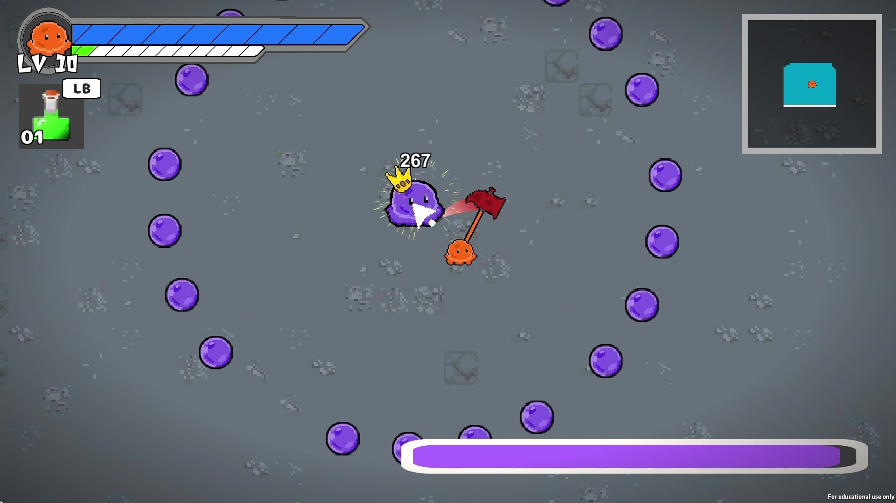
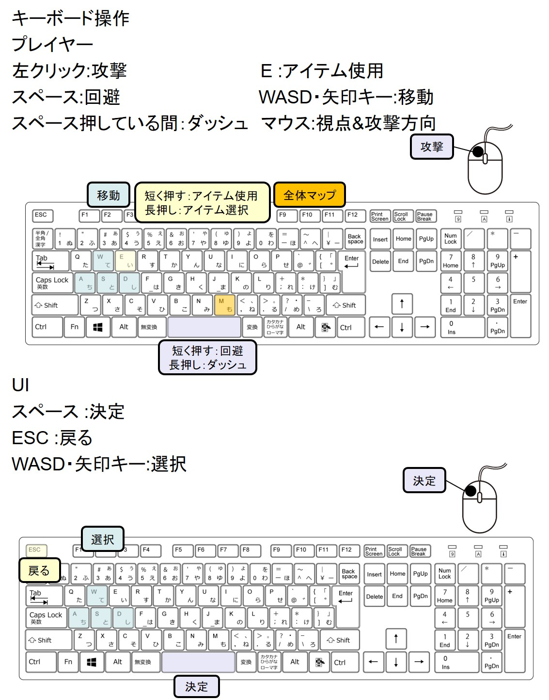
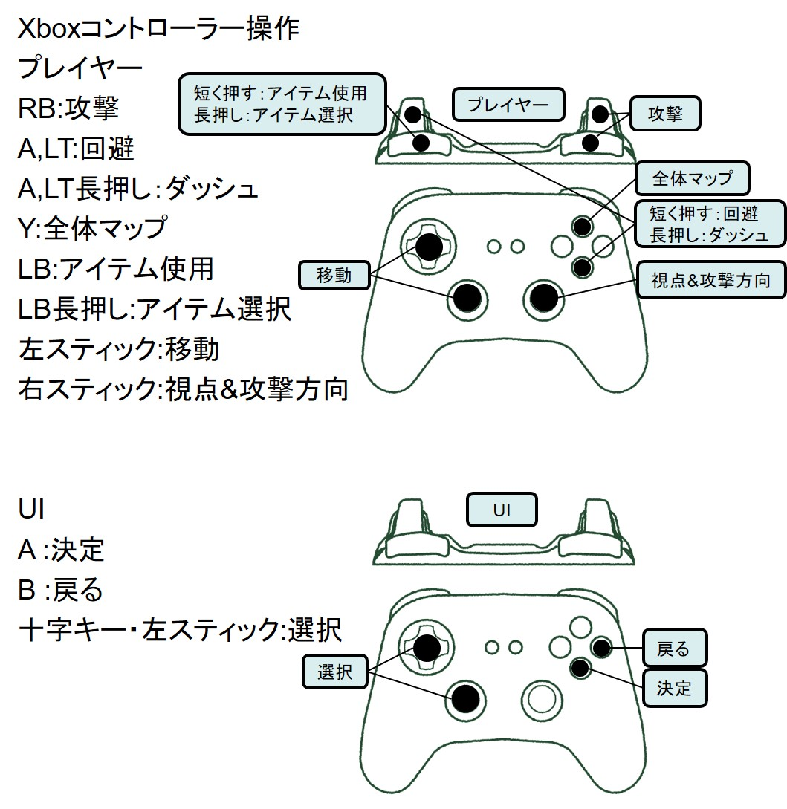
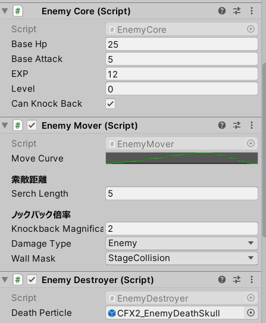
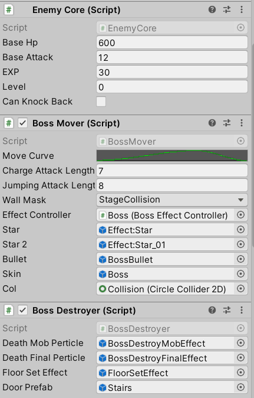
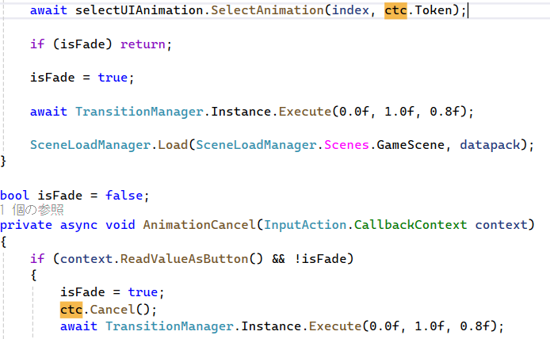

**タイトル**：スライムラッシュ！
  

チーム制作作品（**プログラマー**5人）

**制作期間**：2022/3/4 ～ 2022/5/30（約2ヶ月）  
**開発環境**：Unity(**2020.3.5f1**)、C#、VisualStudio2019、GitHub、Sourcetree  
**ライブラリ**：UniRx、UniTask、DOTween

**操作方法**：  

  


**概要**：  
日本ゲーム大賞2022アマチュア部門に応募するために作った2Dローグライクアクションゲームです。  
好きな武器を選んで自動生成されるマップを進み、ボスを倒すことが目標です。  

チーム一丸となり頑張り、アマチュア部門一次選考を突破できました。

**こだわった点**：  
敵をコンポーネント指向を参考に作ったので、組み換えを楽に行うことができ、他の敵との共通化もすることができた。  



## UIアニメーションのスキップ機能
UniTaskとCancellationTokenを適切に使うことでUIアニメーションのスキップ機能を実装できた。


## TitleUIの共通化
共通の抽象クラスを用いることで管理をまとめることができ、保守性を高めることができた。  

`PageBehaviour.cs`  
```C#
public abstract class PageBehaviour:MonoBehaviour
{
    public abstract UniTask Open();

    public abstract UniTask Close();
}
```
`TitlePageManeger.cs：26行目`
```C#
async private UniTask Open(int ID)
{
	await currentPage.Close();
	currentPage = pages[ID];
	foreach (var item in pages)
	{
		if (item == currentPage)
		{ item.gameObject.SetActive(true); }
		else
		{ item.gameObject.SetActive(false); }
	}
	await currentPage.Open();
}
```