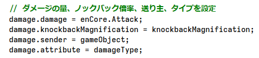
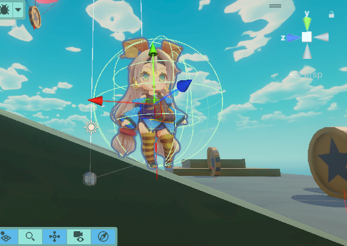
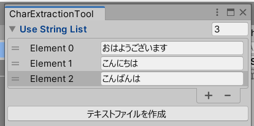
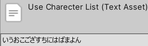
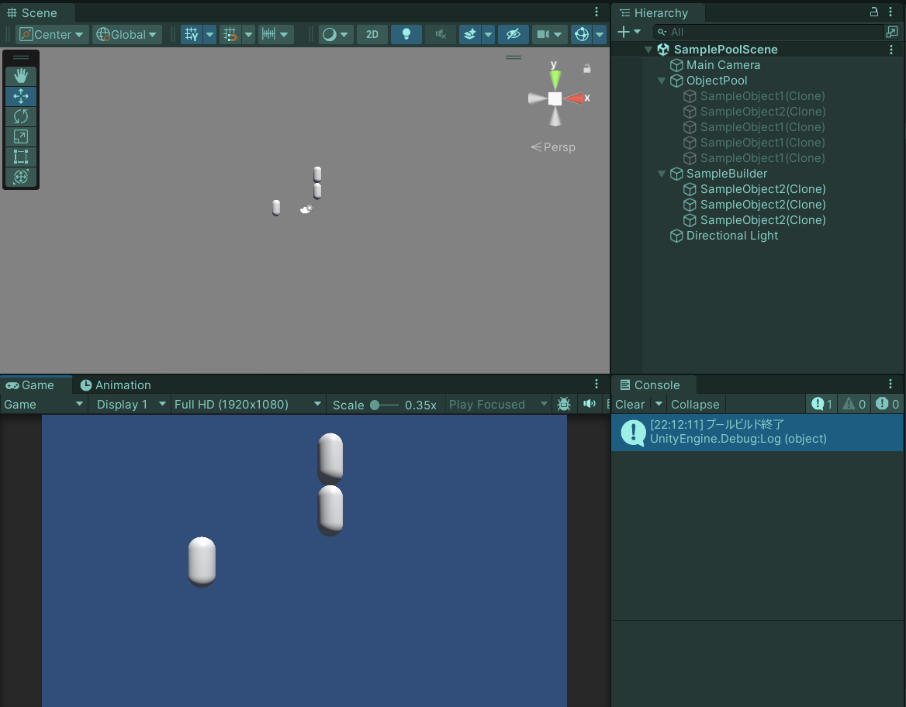
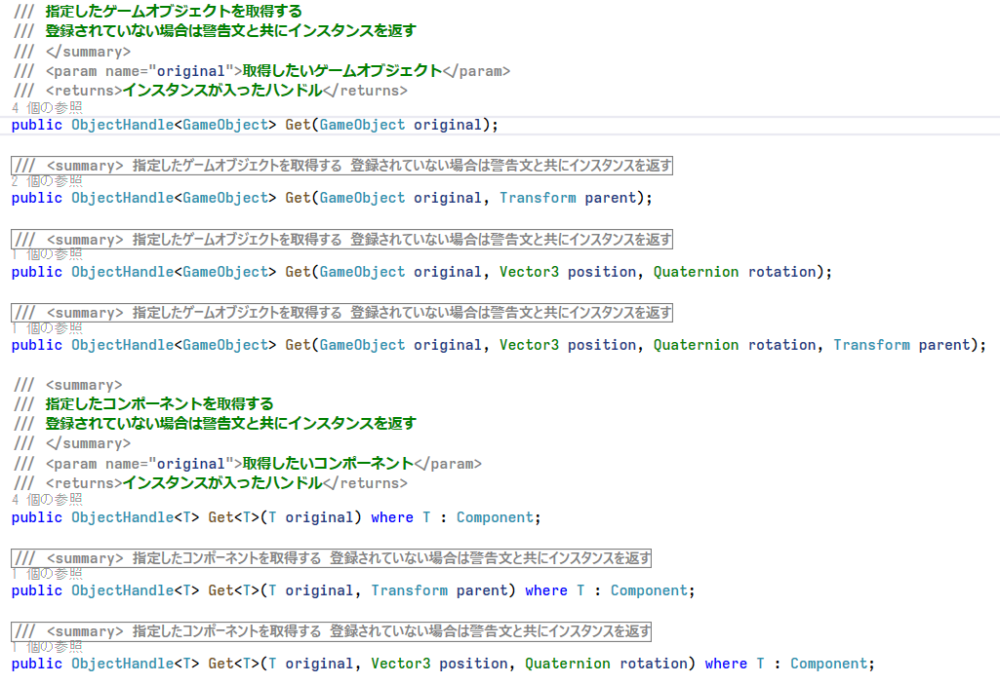
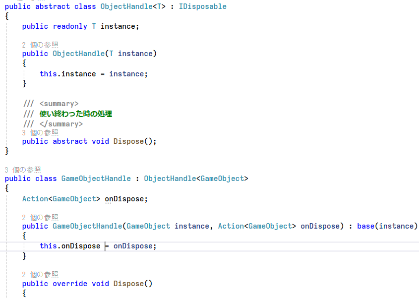

ポートフォリオ

# 挨拶
閲覧頂きありがとうございます。  
このページでは、これまで制作した作品の一部を紹介しています。  
ソースコードはアセットの二次配布防止のため別途GoogleDriveからご覧ください。  

# 自己紹介  
名前：**中野創貴**  
所属：名古屋工学院専門学校 ゲーム総合学科(4年制)  
趣味：プラモデル制作


普段はUnityとC#を使ってゲーム開発をしています。  
チーム制作が好きで、ゲームジャムによく参加しています。

## 将来の展望
なりたい人物像：**高い技術力を周囲に伝えられる伝達力を持つチーフエンジニア**  
理由：先輩やできる友達を頼って今まで成長してきたので、今度は自分が頼れる存在になりたいと思っているからです。

ゲーム開発でやりたいこと：**ユーザーが遊びやすいゲームを作りたい**  
ゲームデザインがおもしろくてもUIや操作が分かりづらいと遊んでいただけないと思うので、テストプレイやフィードバックを大切にしながら開発していきたいです。

技術面でやりたいこと：**保守性の高いコードを書いて円滑な開発を続けたい**  
この先何年も開発していく中で自分がいろんな機能作りやすくなったり、自分の担当箇所が変わる時に後継の方に負担をかけることなく引継ぎができるようになると思っています。


# 目次
- [スキル](#スキル)
- [過去参加イベント](#過去参加イベント)
- [作品紹介](#作品紹介)
  - [チーム制作](#チーム制作)
    - [曲げてすすめ！レーザーダンジョン](#曲げてすすめレーザーダンジョン)
    - [スライムラッシュ！](#スライムラッシュ)
  - [個人制作](#個人制作)
    - [CoinRush3D](#CoinRush3D)
- [ライブラリ紹介](#ライブラリ紹介)
  - [テキストアセット生成ツール](#テキストアセット生成ツール)
  - [複数オブジェクトプール管理](#複数オブジェクトプール管理)
- [書いた記事](#書いた記事)


## スキル


|技術|理解度|学習歴(年)|備考|
|---|---|---|---|
|C#|★★★★☆|3年|問題を自分で調べて解決できます|
|C++|★★★☆☆|2年|現在勉強中で、ミニゲームを作った経験があります|
|DirectX|★★☆☆☆|2年|DX12を触り、3Dモデルの描画をしたことがあります。|
|Unity|★★★★☆|3年|積極的に新機能を触り、様々な機能を勉強してきました|
|GitHub|★★★★☆|3年|マージの際にコードレビューを行い、コードの品質管理を行っています|
|WPF(C#)|★★★☆☆|1年|ゲーム外のツールを複数開発したことがあります|


### 触ったことのあるライブラリ
- UniRx (イベント管理用)
- R3(イベント管理用)
- UniTask (非同期処理用)
- DOTween (Tween用)
- PrimeTween(Tween用)


## 過去参加イベント


|コンテスト|結果|
|---|---|
|UOZUゲームジャム-Hot!Summer!!- 魚津市役所賞|受賞|
|ゲームクリエイター甲子園2023|B.B.スタジオ賞受賞|
|第12回全国専門学校ゲームコンペティション プレイアブル部門|ファイナリスト|
|神ゲー創造主エボリューション2024 ゲームプライズオブジャパン|一次審査ノミネート|


|ゲームジャム|期間|
|---|---|
|第29回 FUKUOKAゲームインターンシップ|1日|
|GlobalGameJam2023|3日|
|GAIRA GAME JAM|1日|
|学内ゲームジャム|7日|


|展示イベント|期間|
|---|---|
|東京ゲームショウ2023 学校ブース|2日|
|第６回 全国エンタメまつり|1日|


### これまでに制作した作品数
個人作品11 ： チーム作品11


# 作品紹介
## チーム制作
## 曲げてすすめ！レーザーダンジョン
<iframe width="560" height="315" src="https://www.youtube.com/embed/vAu2sqNFRJk?si=jxL4nvV1QPAkAsC1?rel=0" title="YouTube video player" frameborder="0" allow="accelerometer; autoplay; clipboard-write; encrypted-media; gyroscope; picture-in-picture; web-share" allowfullscreen></iframe>

日本ゲーム大賞2023アマチュア部門とゲームクリエイター甲子園2023に向けて制作した作品です。  
ゲームクリエイターズギルドEXPO2023ではB.B.スタジオ賞に選ばれました。  
第12回全国専門学校ゲームコンペティション プレイアブル部門ではファイナリストに選ばれました。  

### [詳細な解説](Pages/LaserDungeon.md)

**チーム人数**：6人(プログラマー6)  

**制作期間**：  
(完成) 2023/4/10 ~ 2023/5/31（2ヶ月）  
(バグ修正+リファクタリング) 2023/6/1 ~ 2024/3/1（6ヶ月程度、不定期活動）  

**開発環境**：Unity(2022.3.18f1)、C#、DSPAcion(SE制作ツール)、GitHub、Sourcetree  
**ライブラリ**：UniTask,UniRx,DOTween,CRIWARE  
**主な担当箇所**：ステージの進行制御、UI、セーブデータ


**こだわった点：**
加算シーンを用いてステージSceneと管理Sceneを分けることで、
同時に作業できるようにしたり、共通するものをまとめることができました。

**課題：**
Scene間のデータのやり取りを何を使って行うか

**解決法：**
ScriptableObjectだと削除されずに残ってしまうので、
UnityのScene読み込み時のイベントにメソッド登録して参照が残らないようにして、
参照関係を綺麗にした。  
ServiceLocator等を作成しUnityに依存しないようにインスタンスをハンドリングできるとデバッグしやすくすることができてより良いかもしれない。

[ゲームリンク](https://gameparade.creators-guild.com/works/917)  

## スライムラッシュ！
<iframe width="560" height="315" src="https://www.youtube.com/embed/0nTE3o13VbQ?rel=0" title="スライムラッシュ！" frameborder="0" allow="accelerometer; autoplay; clipboard-write; encrypted-media; gyroscope; picture-in-picture; web-share" allowfullscreen></iframe>

日本ゲーム大賞2022アマチュア部門に向けて制作した作品です。

### [詳細な解説](Pages/SlimeRush.md)

**チーム人数**：5人（プログラマー５）  

**制作期間**：2022/2/15 ~ 2022/5/30（2か月）  

**開発環境**：Unity(2020.3.5f1)、C#、GitHub、Sourcetree  
**ライブラリ**：UniTask, UniRx, DOTween  

**主な担当箇所**：敵とボスの行動パターン、タイトル、リザルト画面


**こだわった点：**  
  
ダメージ用の構造体を作ってダメージの受け渡しを楽に細かくできるようにしました。

## 個人制作
## CoinRush3D
<iframe width="560" height="315" src="https://www.youtube.com/embed/OkVRoHycHWY" title="CoinRush3D" frameborder="0" allow="accelerometer; autoplay; clipboard-write; encrypted-media; gyroscope; picture-in-picture; web-share" referrerpolicy="strict-origin-when-cross-origin" allowfullscreen></iframe>

4年生の時に10日間で制作した個人制作作品です。

### [詳細な解説](Pages/CoinRush3D.md)

個人制作  
**制作期間**：2024/6/16 ~ 2022/12/25（10日間）  
**開発環境**：Unity6Preview(6000.0.5f1)、C#、DSPAcion(SE制作ツール)、GitHub、Sourcetree  
**ライブラリ**：R3,UniTask,DOTween


**こだわった点：**  
プレイヤーの移動処理を作るにあたって以下の２点を最初に決めて作り始めました。  

- タグ比較以外の汎用的な接地判定を用いること
- 斜めの床でずり落ちたり、移動速度が変わらないようにすること

**プレイヤーの接地判定**  


- タグ比較以外の汎用的な接地判定を用いること  

タグ比較では地面オブジェクトに毎回タグ設定する手間がかかってしまうので、レイによるオブジェクトの取得と、法線の比較で接地判定を行うようにしました。


# ライブラリ紹介
## テキストアセット生成ツール



TMProのFontAssetCreatorで文字を被り無しで指定していく作業を効率化するために作ったツールです。

**制作期間**：3時間   
**こだわった点**  

メソッドの速さならHashSetの方が速くはありますがSoretedSetを使うことで、テキストファイル作った時の可読性を高くしました。

`CharExtractionTool.cs：60行目`  
```C#
private void CreateCharacter()
{
    // SortedSetを使い、使用する文字の重複を省く
    SortedSet<char> sortedSet = new();
    foreach (var text in stringList)
    {
        foreach (char c in text)
        {
            sortedSet.Add(c);
        }
    }
```

拡張メソッドを用いることでコードをシンプルにして可読性を高めることができました。

`SerializedPropertyExtension.cs：8行目`  
```C#
public static class SerializedPropertyExtension
{
    public static string[] ToStringArray(this SerializedProperty serializedProperty)
```
メソッド使用時のコード
```C#
stringList = stringArray.ToStringArray();
```


[リポジトリリンク](https://github.com/NkcNakano0203/CharExtractionTool)

## 複数オブジェクトプール管理


Unityのオブジェクトプールを一元管理するために作ったライブラリです。  


メソッドの使い方をUnityのInstantiateに近くすることで初めてでも触りやすくすることにこだわりました。  


呼び出し元にオブジェクトを返す際に使い終わった時の処理をパッケージングすることで、呼び出し側はメソッド呼び出しするだけで返却できるようにしました。  

[リポジトリリンク](https://github.com/NkcNakano0203/nknObjectPool)


# 書いた記事
[学生がGitHubEducationを使ってGitHubCopilotを導入した話](https://qiita.com/NkcNakano0203/items/4f2e0b8cdbdf90d26734)