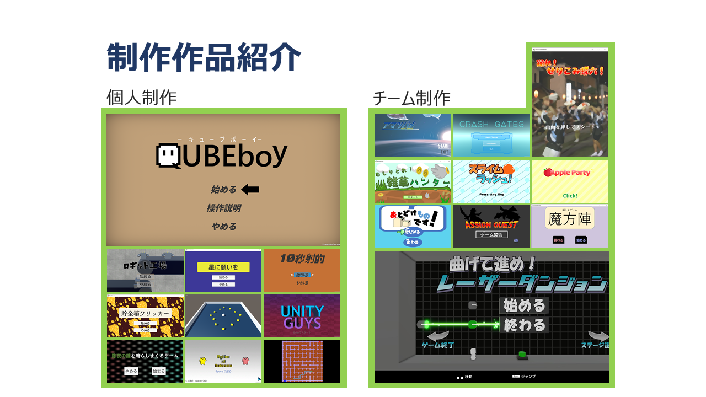
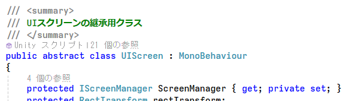
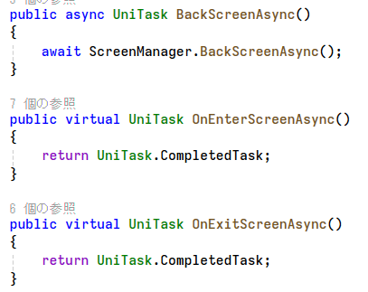
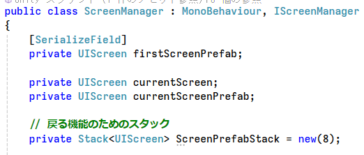

# はじめに
閲覧頂きありがとうございます。                                                                                                                                                                                                                                    
このページでは、これまで制作した作品の一部を紹介しています。  

# 自己紹介  
名前：**中野創貴**  
所属：名古屋工学院専門学校 ゲーム総合学科(4年制)  
趣味：プラモデル制作

普段はUnityとC#を使ってゲーム開発をしています。  
チーム制作が好きで、ゲームジャムによく参加していました。

## 将来の展望
なりたい人物像：**高い技術力と周囲からの信頼を持つチーフエンジニア**  
理由：先輩やできる友達を頼って今まで成長してきたので、
今度は自分が頼れる存在になりたいと思っているからです。

ゲームクリエイターとしてやりたいこと：**ユーザーが遊んで良かったと思えるゲームを作りたい**  
プレイヤー操作やUIの手触りが良くてストレスなく遊べたり、かっこいい演出やカメラワーク等で感動させたりできると遊んで良かったと思ってもらえると考えています。

ゲームプログラマーとしてやりたいこと：**保守性の高いコードを書いて円滑な開発を続けたい**  
こうすることでこの先何年も開発していく中で自分がいろんな機能作りやすくなるのはもちろん、自分の担当箇所が変わる時に後継の方に負担をかけることなく引継ぎができると思っています。

# 目次
- [スキル](#スキル)
- [過去参加イベント](#過去参加イベント)
- [作品紹介](#作品紹介)
  - [チーム制作](#チーム制作)
    - [曲げてすすめ！レーザーダンジョン](#曲げてすすめレーザーダンジョン)
    - [スライムラッシュ！](#スライムラッシュ)
  - [個人制作](#個人制作)
    - [ロボットファクトリー](#ロボットファクトリー)
- [ライブラリ紹介](#ライブラリ紹介)
  - [UI遷移](#ui遷移)
  - [複数オブジェクトプール管理](#複数オブジェクトプール管理)

## スキル

|技術|理解度|学習歴(年)|備考|
|---|---|---|---|
|C#|★★★★☆|3年|問題を調べて解決できます|
|C++|★★★☆☆|2年|現在勉強中で、ミニゲームを作った経験があります|
|DirectX|★★☆☆☆|2年|DX12を触り、3Dモデルの描画をしたことがあります。|
|Unity|★★★★☆|3年|積極的に新機能を触り、様々な機能を勉強してきました|
|GitHub|★★★★☆|3年|マージの際にコードレビューを行い、コードの品質管理を行っています|
|WPF(C#)|★★★☆☆|1年|ゲーム外のツールを複数開発したことがあります|

### 触ったことのあるライブラリ
- UniRx (イベント管理用)
- UniTask (非同期処理用)
- DOTween (Tween用)
- PrimeTween(Tween用)

## 過去参加イベント

|コンテスト|結果|
|---|---|
|UOZUゲームジャム-Hot!Summer!!- 魚津市役所賞|受賞|
|ゲームクリエイター甲子園2023|B.B.スタジオ賞受賞|
|第12回全国専門学校ゲームコンペティション プレイアブル部門|ファイナリスト|

|ゲームジャム|期間|
|---|---|
|第29回 FUKUOKAゲームインターンシップ|1日|
|GlobalGameJam2023|3日|
|GAIRA GAME JAM|1日|
|学内ゲームジャム|7日|

|展示イベント|期間|
|---|---|
|東京ゲームショウ2023 学校ブース|2日|
|第６回 全国エンタメまつり|1日|

### これまでに制作した作品数
個人10作品 ： チーム10作品

# 作品紹介
## チーム制作
## 曲げてすすめ！レーザーダンジョン
<iframe width="560" height="315" src="https://www.youtube.com/embed/vAu2sqNFRJk?si=jxL4nvV1QPAkAsC1?rel=0" title="YouTube video player" frameborder="0" allow="accelerometer; autoplay; clipboard-write; encrypted-media; gyroscope; picture-in-picture; web-share" allowfullscreen></iframe>

日本ゲーム大賞2023アマチュア部門とゲームクリエイター甲子園2023に向けて制作した作品です。  
ゲームクリエイターズギルドEXPO2023ではB.B.スタジオ賞に選ばれました。  
第12回全国専門学校ゲームコンペティション プレイアブル部門ではファイナリストに選ばれました。  

チーム人数：6人(プログラマー6)  
制作期間：  
(完成) 2023/4/10 ~ 2023/5/31（2ヶ月）  
(バグ修正+リファクタリング) 2023/6/1 ~ 2024/3/1（6ヶ月程度、不定期活動）  
開発環境：Unity(2022.3.18f1)、C#、DSPAcion(SE制作ツール)、GitHub、Sourcetree  
ライブラリ：UniTask,UniRx,DOTween,CRIWARE  
主な担当箇所：ステージの進行制御、UI、セーブデータ

[ゲームリンク](https://gameparade.creators-guild.com/works/917)  
[ソースコードリンク](https://drive.google.com/drive/folders/1USkzE8ffkj-mzk2XhuQNEUKhmgDzkwJT?usp=sharing)

## スライムラッシュ！
<iframe width="560" height="315" src="https://www.youtube.com/embed/0nTE3o13VbQ?rel=0" title="スライムラッシュ！" frameborder="0" allow="accelerometer; autoplay; clipboard-write; encrypted-media; gyroscope; picture-in-picture; web-share" allowfullscreen></iframe>

日本ゲーム大賞2022アマチュア部門に向けて制作した作品です。

チーム人数：5人（プログラマー５）  
制作期間：2022/2/15 ~ 2022/5/30（2か月）  
開発環境：Unity(2020.3.5f1)、C#、GitHub、Sourcetree  
ライブラリ：UniTask, UniRx, DOTween
主な担当箇所：敵とボスの行動パターン、タイトル、リザルト画面

## 個人制作
## ロボットファクトリー
<iframe width="560" height="315" src="https://www.youtube.com/embed/RBAzS3qyMlc" title="ロボットファクトリー" frameborder="0" allow="accelerometer; autoplay; clipboard-write; encrypted-media; gyroscope; picture-in-picture; web-share" allowfullscreen></iframe>

２年生の時に２週間で制作した個人制作作品です。

個人制作
制作期間：2022/12/2 ~ 2022/12/19（2週間）  
開発環境：Unity(2021.3.18f1)、C#、DSPAcion(SE制作ツール)、GitHub、Sourcetree  
ライブラリ：UniRx,UniTask,DOTween

[ソースリンク](https://drive.google.com/drive/folders/1fTAgSFtrlmEBGP6Q8GoPFqn4t-VqizuZ?usp=sharing)

# ライブラリ紹介
## UI遷移
<video controls width="560" height="315" src="UILib.mp4" title="Title"></video>

アウトゲームのUI管理を共通化するために作ったライブラリです。
制作期間：2022/12/2 ~ 2022/12/19（2週間）  

抽象クラスを使い共通化しています。    
  
メソッドの実装は継承先に任せることで汎用性を確保しています。

Stackを用いて前のスクリーンに戻る機能を実装しています。

## 複数オブジェクトプール管理

Unityのオブジェクトプールを一元管理するために作ったライブラリです。