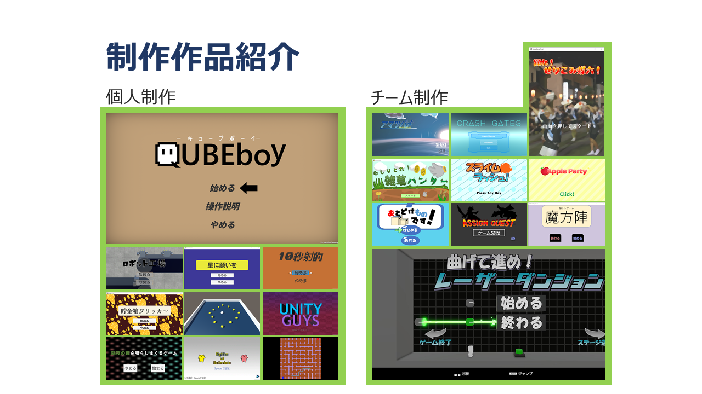

## 自己紹介
志望職種：25卒 クライアントプログラマー  
名前：中野創貴  
所属：名古屋工学院専門学校 ゲーム総合学科(4年制)

これまでに制作した作品数：  
個人10作品 ： チーム10作品

## スキル

|技術|理解度|学習歴(年)|
|---|---|---|
|C#|★★★★☆|3年|
|C++|★★★☆☆|2年|
|Unity|★★★★☆|3年|
|C#__WPF|★★★☆☆|1年|

### 触ったことのあるライブラリ
- UniRx (イベント管理用)
- UniTask   (非同期処理用)
- DoTween   (Tween用)